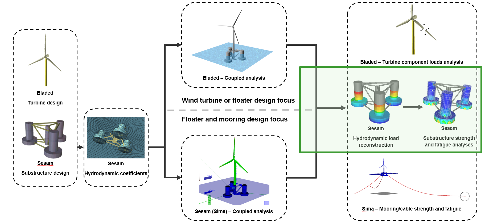

# Direct Load Generation Tutorials and Examples
This folder contains tutorials and examples for Time Domain analyses for [Floating Offshore Wind](https://www.dnv.com/software/services/software-to-design-floating-wind-turbine-support-structures/) using Sesam, focusing on use of the Direct Load Generation workflow. 

The image below illustrates a typical Sesam Time Domain analysis workflow:

  

The following examples focus on the part of the workflow contained in the green box. They demonstrate various ways to read results for one or many design load cases from coupled analysis, then reconstruct the loads and run finite element analysis on the substructure, before doing fatigue and buckling checks.

**_Disclaimer:_ The example models and inputs are only used to serve as examples on how to run Sesam workflows using Python and Jupyter Notebooks. The models and their inputs have not been tuned to be realistic, therefore the results obtained in the Sesam analyses will also not be realistic. We will continue to improve both the examples and the example files to make them more realistic.**

For more information, including how to acquire the necessary software, and how to set up the Python and Jupyter Notebook environments, see the [Readme.md](../Readme.md) file in the parent folder.

# Table of contents
* [Tutorials](#tutorials)
* [Examples](#examples)
  * [Buckling code check](#buckling)
  * [Fatigue analysis](#fatigue)
 
 

# Tutorials 

These tutorials include a step-by-step text description of the workflows as well as the necessary input files to run them. 

* [Plate buckling tutorial](https://myworkspace.dnv.com/download/public/sesam/sesam-workflows/downloads/SesamCore_plate_buckling_tutorial.zip) Learn how to set up and run plate buckling on a simple model. This tutorial shows how to export the capacity model from GeniE and then run Sestra and SesamCore from the command line. Python and a Jupyter notebook reader are *not* required to run this tutorial.

* [Time History Buckling Analysis of EMULF Delta Floater](EMULF_Buckling_Tutorial/EMULF_buckling_tutorial.pdf) This tutorial demonstrates how to export a capacity model from GeniE and run direct load generation in Wasim followed by a structural analysis and buckling assessment in SesamCore. The export of the capacity model is done using the GeniE GUI and the remaining steps are performed by running Python code cells in a Jupyter notebook. The Jupyter notebook demonstrates how a spreadsheet can be used to define the parameters of the design load cases and how to use OneWorkflow to manage and run the analysis. Upon completing the analysis a couple of code examples show how to display selected results and scan for maximum usage factors. The Jupyter notebook and accompanying input files can be found in the folder [EMULF_Buckling_Tutorial/Input](EMULF_Buckling_Tutorial/Input)
 
 

# Other Examples 

Additional examples are available without a detailed description on how to run them. Here, the concepts and technologies applied in the tutorials are used and extended to create other workflows with varying complexity. 

## Buckling code check 

* [EMULF Delta Floater extensive example](EMULF_DeltaFloater_Sesam_ULS/EMULF_DeltaFloater_Sesam_ULS.ipynb) This notebook illustrates how a spreadsheet can be used to define the parameters of the design load cases and how to use OneWorkflow to manage and run the analysis. Separate Wasim load generation runs allow to account for the load factors in the structural analysis. Upon completing the buckling assessment, a variety of methods to display results are demonstrated.  
 

## Fatigue analysis 
These examples demonstrate how to run a simple Sesam Core Fatigue screening check for a Floating OWT model created in GeniE, exposed to time-dependent wave loads coming from a Sima coupled analysis results via load reconstruction in Wasim, using OneWorkflow locally or in the cloud (**_note_**: Cloud support is coming soon!)
 

### Single load case Examples 
These examples run only a single load case.
* [OC4 Wasim SesamCore FLS Python Example Only Python](OC4WasimSesamCoreFLSSingleLoadCase/OC4WasimSesamCoreFLSOnlyPython.py) Pure Python example using no external modules.
* [OC4 Wasim SesamCore FLS Python Example Commands](OC4WasimSesamCoreFLSSingleLoadCase/OC4WasimSesamCoreFLSOnlyUsingCommands.py) Python example using the Sesam Commands module, but not OneWorkflow.

### Multiple load cases 
The parameters to be used in each load case are specified in an Excel spreadsheet.
* [OC4 Wasim SesamCore FLS Jupyter Example ](OC4WasimSesamCoreFLSJupyter/OC4WasimSesamCoreFLSJupyter.ipynb) A Jupyter notebook example demonstrating how to run a few load cases.
* [OC4 Wasim SesamCore FLS Jupyter Example Stepwise](OC4WasimSesamCoreFLSJupyter/OC4WasimSesamCoreFLSJupyterStepwise.ipynb) A Jupyter notebook example demonstrating how to run a few load cases step wise, i.e. adding checking of results after load transfer, before fatigue screening with Sesam Core.
* [OC4 Wasim SesamCore FLS Python Example](OC4WasimSesamCoreFLSPython/OC4WasimSesamCoreFLS.py) The same example as OC4WasimSesamCoreFLSJupyter, but in pure Python.
* [OC4 Wasim SesamCore FLS Python Example Utility Class](OC4WasimSesamCoreFLSPython/OC4WasimSesamCoreFLSUtilityClass.py) A Python example demonstrating how to run a few load cases with the help of a utility class.
  

## Additional documentation
An overview of commonly used template parameters for Wasim, Sestra and Sesam Core [template_parameters_in_use.txt](template_parameters_in_use.txt).
 
 

