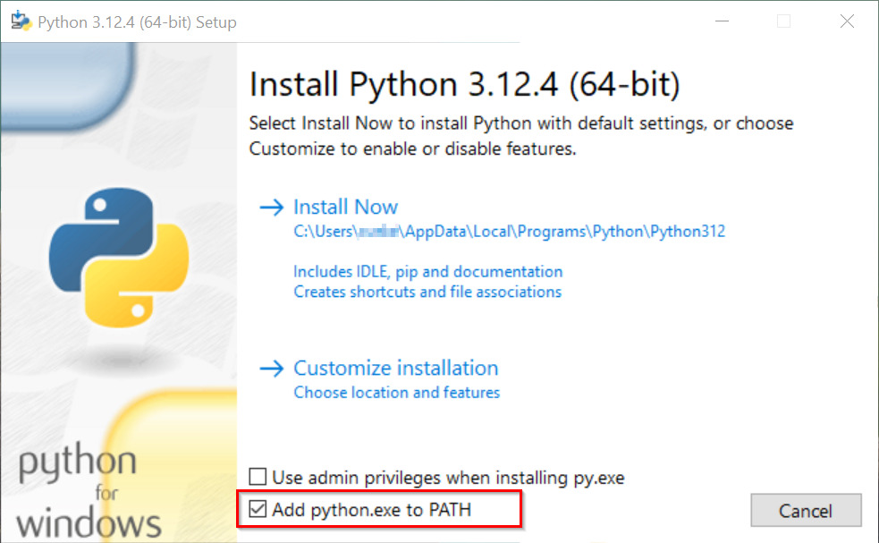
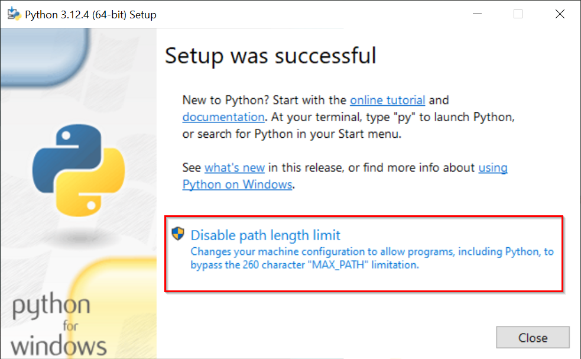
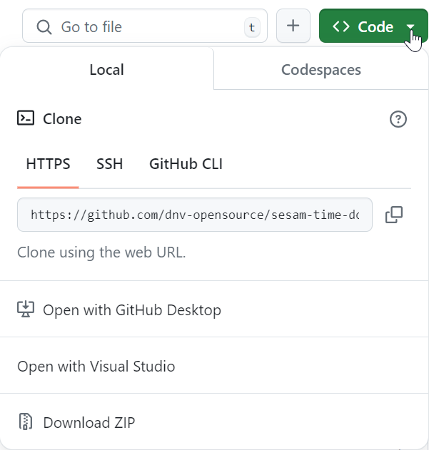

# Sesam Time Domain Examples
Repository containing examples for Time Domain analyses for [Floating Offshore Wind](https://www.dnv.com/software/services/software-to-design-floating-wind-turbine-support-structures/) using Sesam. 
The repository contains various Jupyter notebook examples demonstrating how to run Sesam applications in a workflow including custom Python scripts using the Python library OneWorkflow developed by DNV.

The image below illustrates a typical Time Domain analysis workflow including a coupled analysis:

  

The following examples focus on the part of the workflow contained in the green box. They demonstrate various ways to read results for one or many design load cases from coupled analysis, then reconstruct the loads and run finite element analysis on the substructure, before doing fatigue and buckling checks.

**_Disclaimer:_ The example models and inputs are only used to serve as examples on how to run Sesam workflows using Python and Jupyter Notebooks. The models and their inputs have not been tuned to be realistic, therefore the results obtained in the Sesam analyses will also not be realistic. We will continue to improve both the examples and the example files to make them more realistic.**

**_Note:_**  For new users to Time Domain Buckling Analysis of FOWT structures we recommend to start with the tutorials before running other workflow examples.
 
 

# Table of contents 
* [Prerequisites](#Prerequisites)
* [Tutorials & Examples](#tutorials)
* [Introduction to OneWorkflow](#oneworkflowIntro)
 
 

# Prerequisites 

## Python

OneWorkflow supports Python versions 3.10, 3.11, and 3.12, which are available for download from the official [Python download page](https://www.python.org/downloads/). Please make sure that you have installed one of these versions. We recommend that you use Python version 3.12. 

To ensure a smooth development experience, it is essential that you enable the 'Add python.exe to the PATH' option during installation. This option is usually turned off by default, the image below highlights how to enable it.

 
 

You must verify the default Python version on your system, especially if you have multiple Python installations:
- Open the command line interface (Windows-start-menu --> type cmd --> enter)
- Type "python --version" and press enter to check the default Python version on your system.

It is recommend to disable the MAX_PATH limitation in Windows, to avoid problems with paths exceeding a length of 260 characters. This can be done from the Python setup, but requires local administrator privileges.

See the [Python documentation](https://docs.python.org/3/using/windows.html#removing-the-max-path-limitation) for more information.

 
 

## Jupyter notebook viewer

Several of the examples and tutorials provided use Jupyter notebooks to document the Python code. This requires a Jupyter notebook viewer, several are available online for download.
If you don't have a preferred viewer yet, we recommend downloading and installing [Visual Studio Code](https://code.visualstudio.com/download) from its official website. This open-source code editor is recognised by developers worldwide for its extensive language support and a vast array of extensions. After successful installation, install the following extensions:

- [Python Extension](https://code.visualstudio.com/docs/languages/python) - Enhance your Python development experience in VS Code. Download it from the [VS Code Marketplace](https://marketplace.visualstudio.com/items?itemName=ms-python.python).
- [Jupyter Notebook Extension](https://code.visualstudio.com/docs/datascience/jupyter-notebooks) - Seamlessly integrate Jupyter notebooks with VS Code. Download it from the [VS Code Marketplace](https://marketplace.visualstudio.com/items?itemName=ms-toolsai.jupyter).
  

## Optional: Git
If you would like to [clone](https://git-scm.com/docs/git-clone) this repository, you will need to have [Git](https://git-scm.com/downloads), [GitHub CLI](https://cli.github.com/), or [GitHub Desktop](https://desktop.github.com/) installed. Please refer to the documentation for these tools for instruction on how to use.

Using git, you can clone this repository by opining a command prompt and entering the command: 
`git clone https://github.com/dnv-opensource/sesam-time-domain-examples.git`

SImilarly if you prefer to use GitHub CLI: 
`gh repo clone dnv-opensource/sesam-time-domain-examples`

Clicking on the "<> Code" button on the GitHub UI will give you more examples

You may also download a zip file containing all files from [here](https://github.com/dnv-opensource/sesam-time-domain-examples/archive/refs/heads/main.zip)
  

## Sesam Setup Guide

You need the relevant Sesam products with a license for local runs. Additionally, you need [Application Version Manager](https://sesam.dnv.com/download/windows/applicationversionmanager_3200_inst_win.zip), which does not require a license for local execution. You can download Sesam applications from [here](https://sesam.dnv.com/download/programs.html).

Refer to the [DNV Python Tools Installation Guide](installation/installation.ipynb) for detailed steps on setting up the necessary tools and installing the DNV specific Python packages. These are essential for running all notebooks.
 
 

# Tutorials and examples 
Our tutorials and examples are split into sub-folders, to cover our different Time Domain workflows: 
* [Time Domain Direct Load Generation](direct-load-generation/Readme.md)  
* [Time Domain Response Reconstruction](response-reconstruction/Readme.md)
* [Other Examples](other-examples/Readme.md) (An example for reading and writing SIF is presented here.)

 
 

# Introduction to OneWorkflow 
OneWorkflow is a comprehensive workflow development system that integrates various tools, modules and services seamlessly. This integration streamlines the workflow, enhances efficiency, and promotes a more unified approach to development. With its UI-less interface, OneWorkflow is designed to provide a robust backend for workflow automation. It also offers the flexibility to use the same code for local and cloud-based operations using OneCompute.

Support for Sesam on OneCompute will become public soon. Please contact us on software.support@dnv.com if you are interested in early access to our cloud services. 

 
For a more detailed explanation of OneWorkflow, please consult the [help pages](https://myworkspace.dnv.com/knowledge-centre/sesam-workflows/usermanual).  Here you can learn about the folder structure employed in the examples, explore relevant concepts such as asynchronous programming and find links to the API documentation.
