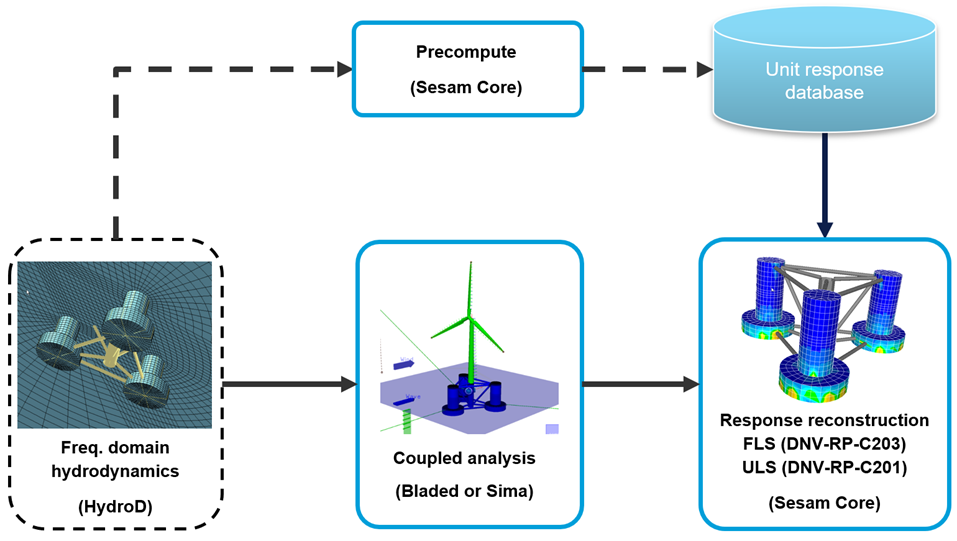

# Sesam Response Reconstruction examples
This folder contains a tutorial with an accompanying Jupyter Notebook for the new Sesam Time Domain Response Reconstruction workflow. This workflow has been specifically created to run analyses on [Floating Offhsore Wind](https://www.dnv.com/software/services/software-to-design-floating-wind-turbine-support-structures/) sub-structures, and offers significant savings both in terms of analysis time and file storage requirements compared with a full time history analysis.

**_Note:_ This tutorial is work in progress, and is based on unrealeased software, which is currently in beta testing.**

The image below illustrates the Time Domain Response Reconstruction workflow in Sesam:

  

**_Disclaimer:_ The example models and input are only used to serve as examples on how to run Sesam workflows using Python and Jupyter Notebooks. The models and their inputs have not been tuned to be realistic, therefore the results obtained in the Sesam analyses will also not be realistic.**
 
 

For an introduction to the Sesam tutorial and examples found on GitHub, please refer to [this](../Readme.md) Readme file.
 
 

# Tutorial 

This tutorial includes a step-by-step text description of the workflow as well as the necessary input files to run them. 

* [Time History Buckling Analysis of EMULF Delta Floater using Response Reconstruction](EMULF_Buckling_Tutorial/EMULF_buckling_tutorial_response_reconstruction.pdf) This tutorial demonstrates how to export a capacity model from GeniE, run the precomputation step in Sesam Core, followed by response reconstruction and buckling analysis for each design load case in Sesam Core. This is variant of the tutorial for Direct Load Generation found [here](../direct-load-generation/EMULF_Buckling_Tutorial/EMULF_Buckling_tutorial.pdf), based on the same EMULF Delta floater model.
 
 

